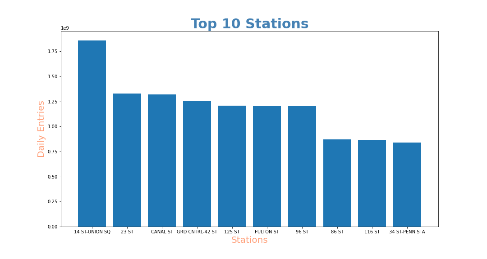

## MTA Analysis

I used a bar chart to compare the foot traffic between the top 10 stations. The figure displays the total daily entries for each station between 4AM - 12PM for 2 years.
Further filtration is needed in order to compare foot traffic between the two years to identify any patterns. However, from these results it is important for the bagel 
start-up to consider establishment of their new store near these stations in order to get the most customer reach.
